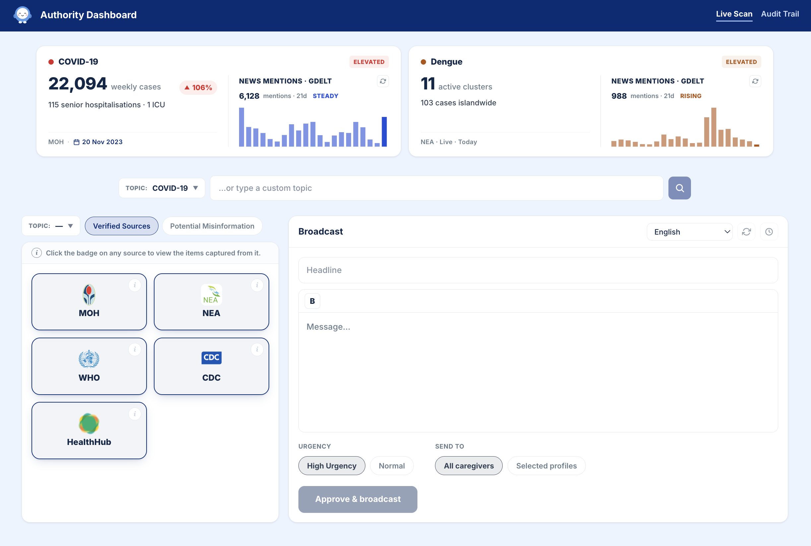
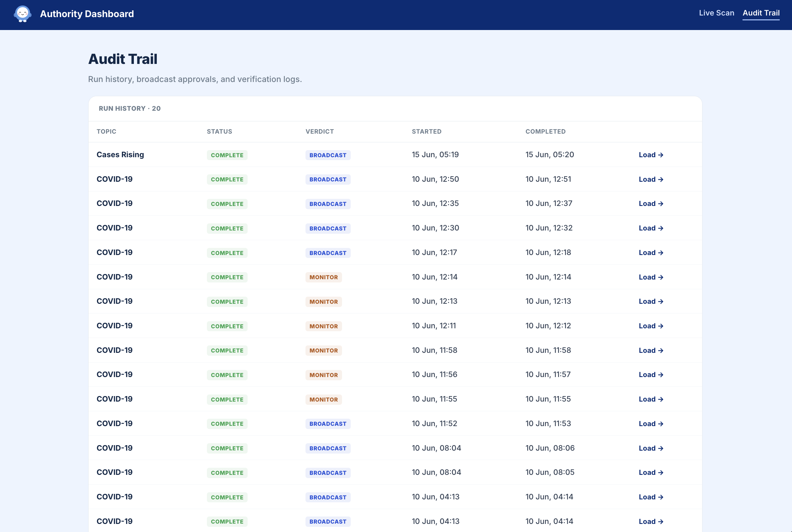

<p align="center">
  
</p>

# ORCA Authority Dashboard

> An agentic research console that turns a health topic into a vetted, multilingual advisory in minutes.

**ORCA** stands for **Outreach, Resource & Caregiver Assistance**.

---

## The problem

During an outbreak, misinformation moves faster than official guidance. Public-health officers have
to manually check multiple sources, work out what's circulating online and what each rumour
distorts, and then craft clear advice for the public — a slow, manual process at exactly the moment
speed matters most.

## How ORCA solves it

The Authority Dashboard is an **agentic research console**. An officer validates an emergency topic,
and ORCA researches it **live** — reading official sources, detecting circulating misinformation,
fact-checking claims, and drafting a caregiver-ready advisory — all streamed to the screen as it
happens.

- **Live AI research** — ORCA browses official sources (MOH / NEA / WHO) and pulls verified findings
  in real time.
- **Misinformation intelligence** — scans public discussion, classifies claims against verified
  guidance, and shows what each one distorts plus a suggested correction.
- **Triage verdict** — a clear **Broadcast / Monitor / No action** recommendation.
- **Watch it think** — the agent's reasoning streams into a live terminal as the run unfolds.
- **One-click advisory** — generates an editable advisory, auto-translates it into 6 languages, and
  targets it by health condition.
- **Real-world signal** — overlays GDELT coverage velocity & media tone alongside live NEA dengue
  data.
- **Audit trail** — every research run and published advisory is recorded.
- **Replay mode** — a deterministic recorded run for a flawless demo: no keys, no network.

## Features

### Live scan



Review official source coverage, misinformation signals, risk indicators, and the editable broadcast draft in one workspace.

### Audit trail



Track completed research runs, triage verdicts, and broadcast approvals for review.

## How it all connects

ORCA has three surfaces that stay in sync in **real time**:

```
 ┌──────────────────────┐   publishes    ┌──────────────────────┐   sends help    ┌──────────────────────┐
 │ ORCA Authority       │   advisory ─►   │ ORCA Caregiver       │   request ─►    │ ORCA Community       │
 │ Dashboard    ◄ HERE  │                 │ Web App              │                 │ Partner Dashboard    │
 │ · health officers    │                 │ · caregivers         │                 │ · partner orgs       │
 └──────────────────────┘                 └──────────────────────┘                 └──────────┬───────────┘
                                                    ▲                                         │
                                                    └───────── fulfilment status ◄────────────┘
```

From the officer's seat:

1. The officer validates an emergency **topic**.
2. ORCA **researches** it live — verified findings, detected misinformation, and a triage verdict.
3. The officer reviews, edits, translates, and **targets** the advisory by health condition.
4. **Publish** — the advisory syncs to the **Caregiver Web App** in real time, where it's tailored to
   each caregiver.
5. Caregivers act on it — and any help they request flows on to the **Community Partner Dashboard**.

## Tech stack

- **Next.js 16** (App Router) · **React 19** · **TypeScript**
- **Tailwind CSS v4** · **framer-motion**
- **Server-side SSE** — a single route runs a 3-phase pipeline (ingest → misinfo → draft) and streams
  a clean event protocol to the UI
- **OpenAI** for agentic research, claim classification, drafting, and translation
- **GDELT** via **Google BigQuery** / DOC API for coverage analytics

## APIs & data sources

| Service | Used for | Details |
|---|---|---|
| OpenAI · Responses API (web search) | Live research of official sources + misinformation scan | `gpt-4o` + `web_search` tool |
| OpenAI · Chat Completions | Classify claims vs verified guidance · trace claim origins | `gpt-4.1-mini` |
| OpenAI · Chat Completions | Draft the advisory + translate into 6 languages | `gpt-4.1-mini` |
| data.gov.sg | Live NEA dengue clusters + official datasets | Open data · no key |
| GDELT | Real-world coverage velocity & media tone | DOC 2.0 API + Google BigQuery |
| Google Fact Check Tools | Corroborating published fact-checks per flagged claim | free API key |

## Getting started

```bash
npm install
# .env.local: OPENAI_API_KEY (+ optional GOOGLE_FACTCHECK_API_KEY and BigQuery credentials)
npm run dev                    # http://localhost:3000
```

> **Tip:** Replay mode runs the entire research-to-broadcast story with no API keys and no network —
> perfect for the stage.

---

<p align="center">
  Built for a hackathon by <strong>acacia tembusu dining hall</strong> 🌳
</p>
